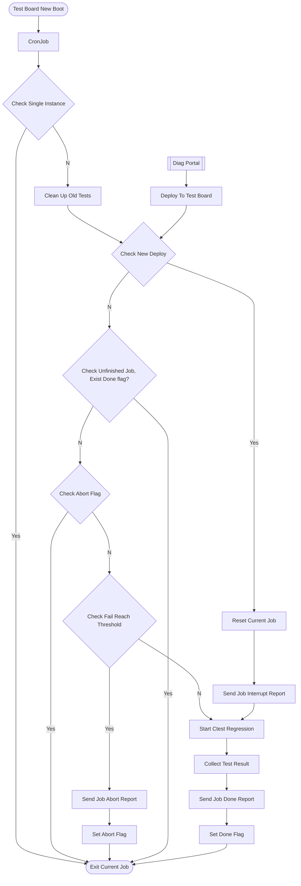

## Report Detail

| key | detail | comment |
| --- | --- | --- |
| ReportType | Report Type | Abort/Interrupt/Done |
| MotherBoard | mother board type | |
| BiosVersion | | |
| TsBuildTime | | |
| TsBuildVersion | | |
| StartTime | | |
| EndTime | | |
| ClkStatus | | |
